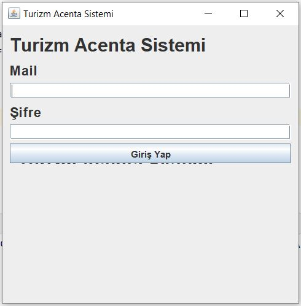
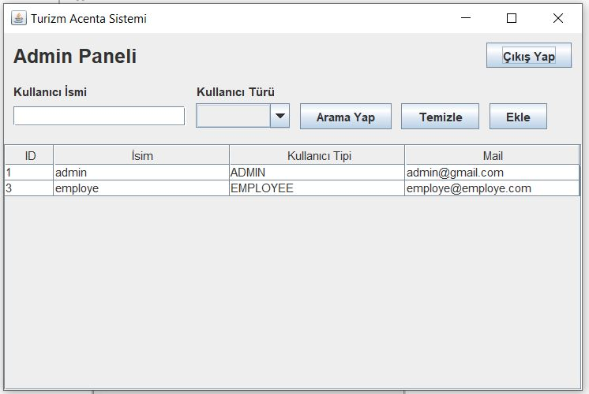
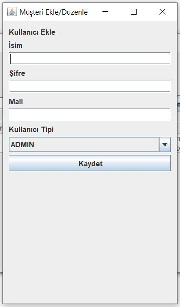
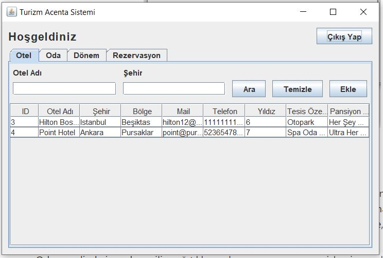
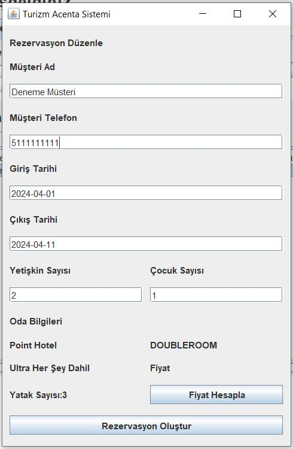

# Turizm Acenta Sistemi

Turizm Acenta Sistemi [Patika.Dev](http://Patika.Dev) Orta Seviye Java Backend Web Development Patikası Java 102 pratik uygulamasıdır.

Proje Admin kullanıcısı ile çalışan ekleme, Çalışan kullanıcısı ile Otel, Oda, Sezon, Rezervasyon ekleme, silme, günceleme işlemleri sağlamaktadır.

## Login Ekranı

Login ekranında kullanıcıdan mail adresi ve şifre bilgileri istenmektedir. Kullanıcının girdiği bilgilere göre mysql database üzerinde kullanıcı araması yapılır. Kullanıcı bulunamadı ise hata verilir. Bulundu ise bulunan kullanıcının tipine(ADMIN,EMPLOYEE) göre giriş işlemi gerçekleşir.

## Admin Panel

Admin Panelde kullanıcılar listelenir. Kullanıcı arama ve ekleme işlemleri burada gerçekleştirilebilir. Kullanıcıların üzerine sağ tıklanarak güncelleme ya da silme işlemleri gerçekleştirilebilir.

## Kullanıcı Ekleme Ekranı

# Employee Panel

Employee panelde ise JtabbedMenu ile Otel Oda Dönem ve Rezervasyon panelleri eklenmiştir. Her panelin içinde kendi nesnesinin ekleme, silme, güncelleme özellikleri bulunmaktadır. Güncelleme ve silme işlemleri Jpopupmenu sayesinde sağ tıklama ile gerçekleştirilebilmekte, Ekleme işlemi ise arama kısmının sağ tarafında bulunan ekle butonu ile sağlanmaktadır.

Oda panelinde ise oda seçilip sağ tıklanarak rezervasyon yapma işlemi gerçekleştirilebilmektedir.

Ekleme ve Güncelleme ekranları aynı yapıya sahiptir. Güncelleme sırasında fieldlarda bulunan veriler mevcut nesneden alınarak doldurulur ve yapılan değişikler sonrası nesneye aktarılır ve oradan veritabanına işlenir. Ekleme işleminde ise fieldlar boştur ve girilen bilgilere göre nesneye bilgiler atanır ve veritabanına işlenir.

## Rezervasyon Güncelleme Ekranı

